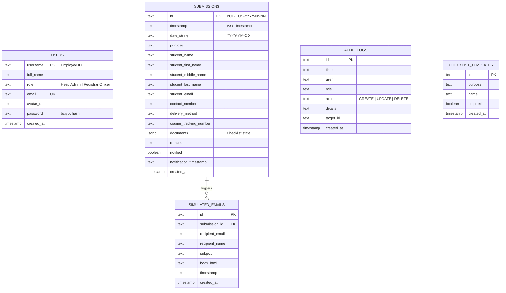
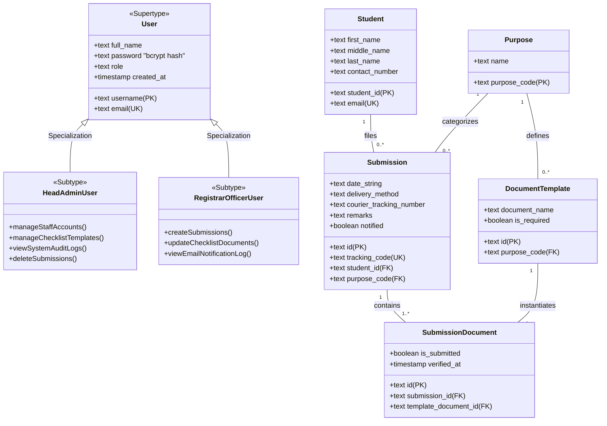

# SYSTEM ANALYSIS AND DESIGN (SAD) REPORT
### Polytechnic University of the Philippines — Open University System (PUP-OUS)
### Document Tracking and Submission System (PDTS)

---

## SECTION 1: SYSTEM OVERVIEW & ARCHITECTURAL DESIGN

### 1.1 Introduction
The **PUP-OUS Document Tracking and Submission System (PDTS)** is a dedicated web-based enterprise solution designed to manage, verify, and audit the submission of academic and administrative documents for Open University students. Given the remote and non-traditional nature of PUP-OUS, students submit physical or digital credentials for various key academic milestones, tracked under five purpose categories: **Admission - Graduation**, **Admission - Bachelor**, **Masteral**, **Comprehensive Exam**, and **Deficiency**. 

PDTS streamlines this lifecycle by providing registrar staff (Registrar Officers and Head Admins) with a centralized ledger to review submissions, track individual document completeness, log system-wide actions for auditing, and trigger automated status email notifications.

### 1.2 Functional Requirements
1. **User Role-Based Access Control (RBAC):** The system implements two roles:
   - **Registrar Officer:** Log submissions, tick checklist items, add remarks, update/edit existing dossiers, view the email notification log.
   - **Head Admin:** All Registrar Officer capabilities, plus: delete submission records, view the read-only Audit Logs, and access Admin Settings (manage staff accounts, manage checklist templates per purpose).
2. **Submission Lifecycle Tracking:**
   - Registration of student dossiers with descriptive metadata (name, contact details, delivery method, courier tracking).
   - Document requirements validation mapped to dynamic templates.
3. **Checklist Template Management:**
   - Real-time creation and enforcement of document checklist packages per academic purpose.
4. **Automated Notification Engine:**
   - Automated simulated/real email notifications dispatched to students with structured "process slips" upon verification changes.
5. **Security & Auditing:**
   - Read-only historic system logs capturing chronological operator stamps, actions, target IDs, and precise details for compliance.
   - Staff account passwords are hashed with bcrypt before being persisted; the API never returns password values in any response. Legacy plaintext rows (from earlier deployments) are transparently rehashed the next time that account logs in.

### 1.3 Non-Functional Requirements
- **Data Integrity:** Strict enforcement of foreign key constraints and transactional consistency.
- **Auditability:** Complete historical non-repudiation of administrative actions.
- **Responsiveness:** Single-Page Application (SPA) responsive design powered by React, Tailwind CSS, and a Node.js/PostgreSQL backend.

---

## SECTION 2: ENTITY-RELATIONSHIP DIAGRAM (ERD) & ENHANCED ERD (EERD)

### 2.1 Entity-Relationship Diagram (ERD)
The basic relational model represents the five key entities currently persisting in our database.



### 2.2 Enhanced Entity-Relationship Diagram (EERD)
To capture **Enhanced** database patterns, we model **Supertype/Subtype relationships** (specialization) for users based on roles (User Generalization), and normalize the multi-valued document checklist out of JSONB to represent a fully relational 3NF/4NF physical data structure.



---

## SECTION 3: DATABASE NORMALIZATION (UNF TO 4NF)

We analyze the progression of database normalization by taking our current practical schema and mapping its transition to higher relational standards.

### 3.1 Unnormalized Form (UNF)
In the Unnormalized Form, the document requirements checklist is stored as a nested array of objects (JSONB) within a single record in the `submissions` table, violating atomic domain constraints. Student data is also duplicated across submissions.

**UNF Representation:**
$$\text{Submission(id, timestamp, date\_string, purpose, student\_name, student\_first\_name, student\_middle\_name, student\_last\_name, student\_email, contact\_number, delivery\_method, documents[ \{name, required, submitted\} ], remarks, notified)}$$

---

### 3.2 First Normal Form (1NF)
To achieve **1NF**, we must remove all multi-valued attributes and repeating groups. The nested JSONB array `documents` is extracted and normalized into a separate table `submission_documents` with atomic rows.

- **USERS Table:**
  $$\text{(username [PK], full\_name, role, email, avatar\_url, password, created\_at)}$$
- **SUBMISSIONS Table:**
  $$\text{(id [PK], timestamp, date\_string, purpose, student\_name, student\_first\_name, student\_middle\_name, student\_last\_name, student\_email, contact\_number, delivery\_method, courier\_tracking\_number, remarks, notified, notification\_timestamp, created\_at)}$$
- **SUBMISSION\_DOCUMENTS Table:**
  $$\text{(\underline{submission\_id [FK]}, \underline{document\_name} [Composite PK], is\_required, is\_submitted)}$$

---

### 3.3 Second Normal Form (2NF)
To achieve **2NF**, the relation must be in 1NF, and all non-key attributes must be **fully functionally dependent** on the primary key. 
In the 1NF table `SUBMISSION_DOCUMENTS`, the attribute `is_required` is determined solely by the checklist template configuration of the *purpose*, not by the specific submission dossier itself. Storing it here creates a partial dependency.

We resolve this by creating a `CHECKLIST_TEMPLATES` table and mapping submitted status independently:

- **CHECKLIST\_TEMPLATES Table:**
  $$\text{(template\_id [PK], purpose, document\_name, is\_required)}$$
- **SUBMISSION\_DOCUMENTS Table (Fully 2NF):**
  $$\text{(\underline{submission\_id [FK]}, \underline{template\_id [FK]} [Composite PK], is\_submitted)}$$

---

### 3.4 Third Normal Form (3NF)
To achieve **3NF**, the relations must be in 2NF, and we must **eliminate transitive dependencies** (where a non-key attribute depends on another non-key attribute).
In the `SUBMISSIONS` table, the student contact details (`student_first_name`, `student_middle_name`, `student_last_name`, `student_email`, `contact_number`) depend on the student identity. If a student submits multiple applications, this data is duplicated.
Transitive Dependency: $$\text{Submission ID} \rightarrow \text{Student Email} \rightarrow \text{Student Name, Contact Number}$$

We separate this into a distinct `STUDENTS` table:

- **STUDENTS Table:**
  $$\text{(student\_email [PK], student\_first\_name, student\_middle\_name, student\_last\_name, contact\_number, created\_at)}$$
- **SUBMISSIONS Table (Fully 3NF):**
  $$\text{(id [PK], timestamp, date\_string, purpose, student\_email [FK], delivery\_method, courier\_tracking\_number, remarks, notified, notification\_timestamp, created\_at)}$$

---

### 3.5 Fourth Normal Form (4NF)
To achieve **4NF**, a relation must be in 3NF and contain **no multi-valued dependencies (MVD)**, meaning a record must not contain independent 1-to-many relationships.
Suppose students are allowed to register multiple independent *Institutional Emails* AND multiple *Secondary Emergency Contacts*. If we stored both of these directly inside the `STUDENTS` table, we would create a multi-valued dependency ($A \twoheadrightarrow B \mid C$), leading to severe update anomalies.

To satisfy **4NF**, we isolate these independent multi-valued dimensions into their own junction structures:
- **STUDENTS Table:**
  $$\text{(student\_email [PK], student\_first\_name, student\_middle\_name, student\_last\_name, primary\_contact)}$$
- **STUDENT\_SECONDARY\_EMAILS Table:**
  $$\text{(\underline{student\_email [FK]}, \underline{alternative\_email} [Composite PK])}$$
- **STUDENT\_EMERGENCY\_CONTACTS Table:**
  $$\text{(\underline{student\_email [FK]}, \underline{contact\_phone} [Composite PK], contact\_name)}$$

---

## SECTION 4: PRODUCTION-READY SQL QUERIES

These queries represent direct execution scripts designed for PostgreSQL.

### 4.1 EASY QUERIES (Basic operations, metrics, and insertions)

#### Query 1: Retrieve All Pending Submissions for a Specific Purpose
```sql
SELECT id, student_name, student_email, date_string, notified 
FROM submissions 
WHERE purpose = 'Masteral'
ORDER BY date_string DESC;
```

#### Query 2: Insert a New Audit Log Record
```sql
INSERT INTO audit_logs (id, timestamp, "user", role, action, details, target_id, created_at)
VALUES (
    'audit-' || extract(epoch from now())::text,
    to_char(now(), 'YYYY-MM-DD"T"HH24:MI:SS"Z"'),
    'Prof. Maria Santos',
    'Registrar Officer',
    'CREATE',
    'Created a new checklist requirement template for Graduation applications.',
    'grad-temp-001',
    NOW()
);
```

#### Query 3: Count Active Staff by Role
```sql
SELECT role, COUNT(*) as staff_count 
FROM users 
GROUP BY role;
```

---

### 4.2 MODERATE QUERIES (Aggregations, joins, filters)

#### Query 1: Join Submissions with Email Notifications to Check Notification Velocity
This query calculates the delay in hours between registering a submission and dispatching the notification email.
```sql
SELECT 
    s.id AS submission_code,
    s.student_name,
    s.purpose,
    e.subject,
    e.timestamp AS email_sent_time,
    s.timestamp AS submission_time,
    (EXTRACT(EPOCH FROM (e.created_at - s.created_at)) / 3600)::numeric(10,2) AS conversion_delay_hours
FROM submissions s
INNER JOIN simulated_emails e ON s.id = e.submission_id
ORDER BY conversion_delay_hours DESC;
```

#### Query 2: Document Completeness Completion Rate Analysis
Processes our JSONB checklist elements inline to figure out which submissions have satisfied 100% of their checklist items.
```sql
SELECT 
    s.id AS tracking_code,
    s.student_name,
    s.purpose,
    (
        SELECT COUNT(*) 
        FROM jsonb_to_recordset(s.documents) AS x(name text, required boolean, submitted boolean)
    ) AS total_items,
    (
        SELECT COUNT(*) 
        FROM jsonb_to_recordset(s.documents) AS x(name text, required boolean, submitted boolean)
        WHERE x.submitted = true
    ) AS submitted_items,
    ROUND(
        (100.0 * (
            SELECT COUNT(*) 
            FROM jsonb_to_recordset(s.documents) AS x(name text, required boolean, submitted boolean)
            WHERE x.submitted = true
        )) / NULLIF((
            SELECT COUNT(*) 
            FROM jsonb_to_recordset(s.documents) AS x(name text, required boolean, submitted boolean)
        ), 0), 
        2
    ) AS completion_percentage
FROM submissions s
ORDER BY completion_percentage ASC;
```

---

### 4.3 DIFFICULT QUERIES (Window functions, analytics, complex CTEs)

#### Query 1: Chronological Action Auditing by User Session with Window Functions
This query tracks the dynamic transaction velocity of staff actions, showing the time elapsed since each staff member's previous administrative operation.
```sql
WITH user_activities AS (
    SELECT 
        id,
        "user" AS staff_name,
        role,
        action,
        details,
        timestamp,
        created_at,
        LAG(created_at) OVER (
            PARTITION BY "user" 
            ORDER BY created_at ASC
        ) AS previous_action_time
    FROM audit_logs
)
SELECT 
    staff_name,
    role,
    action,
    details,
    timestamp,
    previous_action_time,
    ROUND(
        (EXTRACT(EPOCH FROM (created_at - previous_action_time)) / 60)::numeric, 
        2
    ) AS minutes_since_last_action
FROM user_activities
ORDER BY staff_name ASC, timestamp DESC;
```

#### Query 2: Institutional Bottleneck & Performance Report (Checklist Completion Metrics)
An advanced analytical ledger. For each purpose category, it compiles:
1. Total applications registered.
2. The percentage of dossiers that are fully complete.
3. The average number of missing/pending documents per student folder.
4. Total simulated email alerts triggered.
```sql
WITH submission_breakdown AS (
    SELECT 
        s.id,
        s.purpose,
        s.notified,
        (
            SELECT COUNT(*) 
            FROM jsonb_to_recordset(s.documents) AS x(name text, required boolean, submitted boolean)
            WHERE x.submitted = false AND x.required = true
        ) AS missing_required_count,
        (
            SELECT COUNT(*) 
            FROM jsonb_to_recordset(s.documents) AS x(name text, required boolean, submitted boolean)
        ) AS total_count,
        (
            SELECT COUNT(*) 
            FROM jsonb_to_recordset(s.documents) AS x(name text, required boolean, submitted boolean)
            WHERE x.submitted = true
        ) AS completed_count
    FROM submissions s
),
metrics_by_purpose AS (
    SELECT 
        sb.purpose,
        COUNT(sb.id) AS total_submissions,
        COUNT(CASE WHEN sb.missing_required_count = 0 THEN 1 END) AS compliant_submissions,
        ROUND(AVG(sb.missing_required_count), 2) AS avg_missing_required,
        SUM(CASE WHEN sb.notified = true THEN 1 ELSE 0 END) as total_notifications_dispatched
    FROM submission_breakdown sb
    GROUP BY sb.purpose
)
SELECT 
    m.purpose AS academic_purpose,
    m.total_submissions,
    m.compliant_submissions,
    ROUND((100.0 * m.compliant_submissions) / NULLIF(m.total_submissions, 0), 2) AS institutional_compliance_rate,
    m.avg_missing_required AS avg_missing_essential_docs,
    m.total_notifications_dispatched,
    RANK() OVER (ORDER BY (100.0 * m.compliant_submissions) / NULLIF(m.total_submissions, 0) DESC) as compliance_rank
FROM metrics_by_purpose m;
```

---

## SECTION 5: CONCLUSION & DESIGN BEST PRACTICES

This System Analysis and Design documentation models the transition of the **PUP-OUS Document Tracking and Submission System (PDTS)** from the current web-based implementation using JSONB structures into a fully enterprise-grade, normalized relational data layout.

### Recommended Implementation Standards:
1. **Dynamic JSONB vs. Relational Normalization:** Use JSONB (as implemented in the current system) for rapid layout changes and dynamic document parameters. When scaling to high-concurrency systems with millions of records, migrate to the **EERD / 3NF Relational** structure defined in this report to utilize optimized index joins.
2. **Indexing:** Create a B-Tree index on `submissions(purpose)` and a GIN index on `submissions(documents)` if JSONB persistence is maintained.
3. **Audit Trail Security:** Ensure the `audit_logs` table has exclusively `INSERT` privileges (no `UPDATE` or `DELETE`) for administrative users to enforce non-repudiation.
